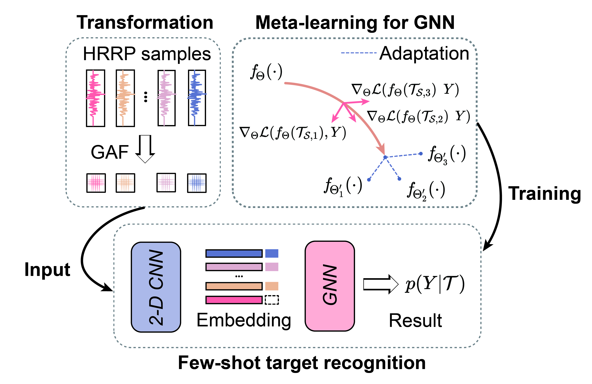

# MLGNN: Meta-Learning for Graph Neural Networks :zap:
This repository provides the official implementation of MLGNN proposed in our work *Meta-Learning for Graph Neural Networks in Few-shot Learning*.

---

> Few-shot Learning (FSL) challenges deep learning models to adapt to novel categories with minimal supervision. MLGNN introduces a novel meta-learning framework specifically designed for Graph Neural Networks (GNNs), enabling effective knowledge transfer through task-set based episodic training. Our approach features dual embedding networks for 1D/2D data processing and optimized task construction strategies. Experimental results demonstrate MLGNN's superior performance on HRRP and GAF datasets, achieving 8.72% improvement in 5-way 1-shot accuracy compared to baseline methods.

<p align="center">
  
</p>

---

## Platform :pushpin:
Developed and tested on PyCharm IDE with Conda environment. Recommended OS:
- Ubuntu 20.04+ 
- Windows 10/11 (WSL2 recommended)

---

## Dependencies :wrench:
```angular2html
conda create -n mlgnn python=3.8
conda activate mlgnn
pip install torch==2.2.0 torchvision==0.17.0
pip install scikit-learn==1.2.2 networkx==3.1
```

---

## Dataset Structure :file_folder:
Prepare your data with following structure:
```bash
data/
├── hrrp3/
│   └── train/
│       ├── class_1/
│       └── class_2/
└── gaf12/
    └── train/
        ├── category_a/
        └── category_b/
```

---

## Quick Start :rocket:
1. **Configure dataset** in `argument.py`:
```python
DATASET = 'gaf12'  # or 'hrrp3'
```

2. **Select embedding architecture** in `trainer.py`:
```python
# For 2D GAF data
self.cnn_feature = EmbeddingCNN2D(image_size, cnn_feature_size, cnn_hidden_dim, cnn_num_layers)

# For 1D HRRP data 
self.cnn_feature = EmbeddingCNN1D(image_size, cnn_feature_size, cnn_hidden_dim, cnn_num_layers)
```

3. **Launch training**:
```bash
python main.py --dataset gaf12 --num_episodes 1000 --shot_num 5
```

---

## Core Components :triangular_flag_on_post:
- `gnn.py`: Implements the graph neural network architecture.
- `trainer.py`: Contains training loop and meta-learning logic.
- `dataloader/`: Handles task generation and data processing.
- `utils/`: Includes visualization tools and metric calculators.

---

## License :page_facing_up:
This project is licensed under the MIT License - see the [LICENSE](LICENSE) file for details.

---

## Contact :email:
**Lingfeng Chen**  
:office: National University of Defense Technology  
:e-mail: [chenlingfeng@nudt.edu.cn](mailto:chenlingfeng@nudt.edu.cn)  
:globe_with_meridians: [Personal Homepage](http://lingfengchen.cn/)  
